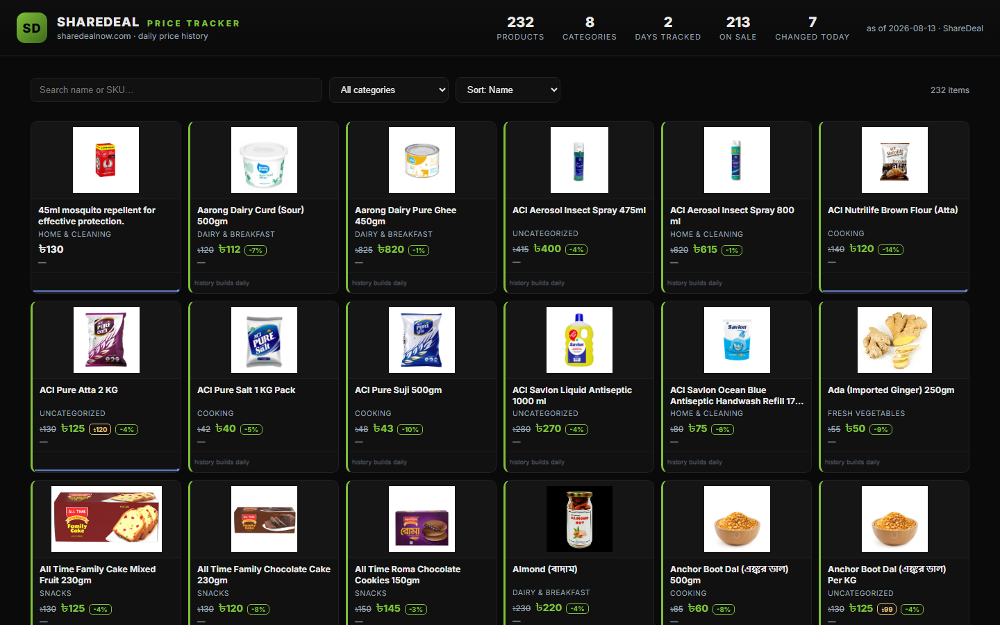

# 🛍️ Sharedeal Deals & Analytics Engine

> **Promotional Deal Tracking & Flash-Sale Price Intelligence** — A production-ready analytics engine and real-time dashboard designed for monitoring price fluctuations, inventory stock states, and promotional deals.

---

## 📌 Executive Summary

**sharedeal** delivers high-precision price history monitoring and catalog analytics for e-commerce and retail operations. The system systematically captures product metadata, normalizes per-unit prices, tracks promotional discounts over time, and presents actionable market insights through an intuitive, responsive web interface.

---

## 🚀 Key Features

- **📈 Historical Price Tracking**: Track price trends, discount percentages, and availability states over time.
- **🔍 Advanced Filtering & Sorting**: Filter items by category, price drops, discount ratios, and keyword search.
- **⚡ Fast Responsive Dashboard**: Zero-latency interactive data visualizer built with modern CSS and modular JS.
- **📊 Export & Data Ingestion**: Structured JSON & HAR extraction pipelines for background analytical processing.

---

## 📸 Screenshots

---

## 🏗️ System Architecture

`
┌─────────────────────────┐      ┌──────────────────────────┐      ┌────────────────────────┐
│  Ingestion & Scrapers   │ ───► │  Data Normalization ETL  │ ───► │  Frontend Dashboard    │
│  (HAR / REST APIs / Py) │      │  (JSON / SQLite Storage) │      │  (HTML5 / CSS3 / JS)   │
└─────────────────────────┘      └──────────────────────────┘      └────────────────────────┘
`

---

## 📁 Repository Structure

`
sharedeal/
├── frontend/             # Single-page web dashboard files
│   ├── index.html        # Main dashboard interface
│   ├── script.js         # Interactive filtering & state management logic
│   └── style.css         # Custom responsive styles & CSS tokens
├── screenshots/          # Embedded screenshot previews
│   └── dashboard.png     # Dashboard screenshot preview
├── extract_har.py        # HAR file parsing & JSON extraction script
└── scraper.py            # Automated network scraper engine
`

---

## 🛠️ Usage & Quick Start

### 1. Launch Local Dashboard Server
`ash
python -m http.server 8000
# Open http://localhost:8000/frontend/ in your browser
`

### 2. Run Data Scraper Engine
`ash
python scraper.py
`

---

## 🚀 Future Work & Industrial Roadmap

To elevate this platform to an enterprise-grade, production-ready product meeting current industrial standards, the following strategic goals and architecture enhancements are planned:

### 1. 🏗️ High-Availability Microservices & Infrastructure
- **Containerization & Orchestration**: Package ingestion workers, APIs, and dashboards into Docker containers with deployment via **Kubernetes (K8s)** and Helm charts for autoscaling during peak traffic hours.
- **Distributed Ingestion Workers**: Transition from localized scraping scripts to an asynchronous, fault-tolerant worker pool utilizing **Celery + Redis** or **Temporal.io** with automated proxy rotation, rate-limiting retry strategies, and CAPTCHA bypass capabilities.
- **High-Performance API Gateway**: Implement an enterprise API Gateway (Kong / Envoy) providing OAuth2 / JWT authentication, TLS termination, and granular rate limiting (Token Bucket algorithm).

### 2. 📊 Enterprise Data Engineering & Streaming Pipelines
- **Data Lakehouse Architecture**: Store multi-year raw price histories using **Apache Parquet / Delta Lake** or **Google BigQuery** for scalable analytical queries across millions of SKU updates.
- **Real-Time CDC & Message Streaming**: Integrate **Apache Kafka** or **NATS** for Change Data Capture (CDC) to stream price change events instantly to downstream analytics and notification consumers.
- **Automated Workflow Orchestration**: Schedule and monitor data ingestion, ETL pipelines, and unit normalization using **Apache Airflow** or **Prefect** integrated with **dbt** for dynamic data transformations.

### 3. 🧠 Machine Learning & Advanced Market Intelligence
- **Predictive Price Forecasting**: Deploy **Prophet** and **LSTM Neural Networks** to predict future price drops, historical promotion trends, and seasonal discount cycles.
- **Anomaly & Surge Detection**: Build ML models to identify artificial price hikes before promotional sales, mislabeled unit metrics, and phantom stock availability.
- **Semantic Product Entity Matching**: Utilize vector embeddings (OpenAI / Sentence-Transformers) paired with **pgvector** / **Pinecone** to match identical SKUs across competitor platforms despite variations in naming formats.

### 4. 🔐 Security, Compliance & System Observability
- **Zero-Trust Security & RBAC**: Enforce Role-Based Access Control (RBAC), AES-256 GCM payload encryption at rest, and secret rotation via HashiCorp Vault.
- **Full Observability Stack**: Instrument services with **OpenTelemetry**, emitting distributed traces, Prometheus metrics, and structured logs to **Grafana Loki & Tempo** dashboards.
- **SLA Alerting & Webhook Engine**: Provide instant trigger notifications via **Telegram Bot API**, **Discord Webhooks**, email notifications, and enterprise SMS gateways when watched items reach target prices.

### 5. 📱 Next-Gen User Experience & Mobile Platforms
- **Cross-Platform Mobile App**: Develop a dedicated **React Native / Flutter** app featuring push notifications for price drops, barcode scanning in physical stores, and personalized deal watchlists.
- **Progressive Web App (PWA)**: Upgrade the dashboard to a full PWA with offline caching via Service Workers, dynamic theme switching, and desktop application installability.
